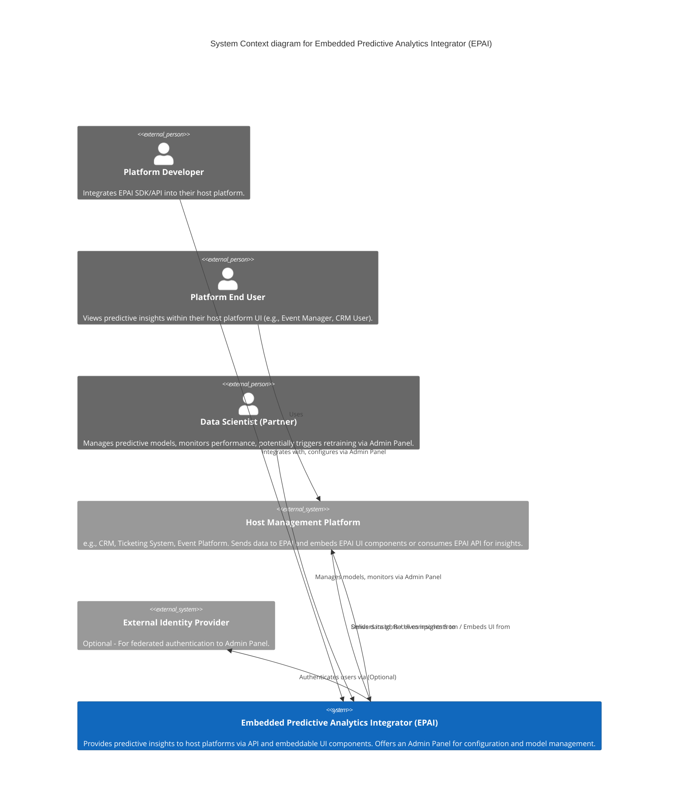

# C4 Model: Embedded Predictive Analytics Integrator

This document outlines the System Context (Level 1) and Container (Level 2) diagrams for the Embedded Predictive Analytics Integrator.

## Level 1: System Context Diagram

**Description:**
The System Context diagram shows the Embedded Predictive Analytics Integrator (EPAI) as a single black box, its key users (personas), and the external systems it interacts with.

**Diagram:**


**Key Interactions:**
-   **Platform Developers** use the EPAI's SDK and APIs to integrate predictive capabilities into their Host Management Platforms. They also use the Admin Panel for configuration.
-   **Data Scientists (Partner)** use the Admin Panel to manage predictive models, monitor their performance, and potentially trigger retraining cycles.
-   **Host Management Platforms** send operational data (e.g., event details, user profiles, sales data) to EPAI and receive predictive insights. They may embed EPAI's UI components or consume insights via API to display to their Platform End Users.
-   **EPAI** ingests data, orchestrates model execution, generates insights, and delivers these back to the Host Platforms. It also provides an Admin Panel for management.
-   Optionally, EPAI may integrate with an **External Identity Provider** for federated authentication to its Admin Panel.

## Level 2: Container Diagram

**Description:**
The Container diagram zooms into the Embedded Predictive Analytics Integrator (EPAI) system, showing its main logical containers (applications, data stores, etc.) and their interactions. This architecture reflects the technology choices validated during the Proof of Concept phase.

**Finalized Technology Stack (Post-PoC)**
- **Backend-as-a-Service (BaaS)**: **Supabase**
  - **Core Database**: PostgreSQL
  - **Authentication**: Supabase Auth (JWT-based)
  - **Serverless Functions**: Supabase Edge Functions (for lightweight, trusted operations)
- **ML Model Serving**: **Hugging Face Inference Endpoints** (for production-grade, scalable model serving)
- **Data Processing (Initial Batch)**: **Python + Pandas** (executed in a serverless function or dedicated container)
- **Frontend SDK**: **React (Vite)**
- **ML Experiment Tracking**: **MLflow** (self-hosted or managed, for tracking model development)
- **Containerization (for services not on Supabase/HF)**: **Docker**

**Diagram:**
```mermaid
C4Container
  title Container diagram for Embedded Predictive Analytics Integrator (EPAI)

  Person_Ext(platformDev, "Platform Developer")
  Person_Ext(dataScientist, "Data Scientist (Partner)")
  System_Ext(hostPlatform, "Host Management Platform")
  System_Ext(hf_endpoints, "Hugging Face Inference Endpoints", "External Model Serving")

  System_Boundary(epai_boundary, "Embedded Predictive Analytics Integrator (EPAI) on Supabase") {
    
    Container(edge_functions, "API & Orchestration Logic", "Supabase Edge Functions (Deno/TypeScript)", "Handles all incoming requests, authentication via Supabase Auth, orchestration of other services (e.g., calling Hugging Face). The primary external interface.")
    
    Container(admin_panel_frontend, "Admin Panel Frontend", "React (SPA)", "Web interface for Platform Developers and Data Scientists to manage their EPAI integration and models. Hosted via Supabase Hosting.")
    
    Container(sdk_components, "UI Embedding SDK", "React (JavaScript Library)", "Set of embeddable UI components (widgets) for host platforms to display insights. Not a running service, but a deployable NPM package.")

    ContainerDb(primary_db, "Primary Database", "Supabase PostgreSQL", "Stores partner information, API keys, usage logs, prediction request logs, and model metadata.")
    
    ContainerDb(storage, "File Storage", "Supabase Storage", "Stores larger files, potentially data uploads or model-related artifacts not in a dedicated registry.")

  }

  Rel(platformDev, admin_panel_frontend, "Uses, Configures integrations via", "HTTPS")
  Rel(platformDev, sdk_components, "Integrates into Host Platform", "NPM Install")

  Rel(dataScientist, admin_panel_frontend, "Uses, Manages models via", "HTTPS")

  Rel(hostPlatform, edge_functions, "Sends data to, Requests insights from", "HTTPS/JSON")

  Rel(edge_functions, hf_endpoints, "Requests predictions from", "HTTPS/JSON")
  Rel(edge_functions, primary_db, "Reads/Writes partner data, logs requests/predictions")
  Rel(edge_functions, storage, "Reads/Writes files (e.g., data uploads)")
  
  Rel(admin_panel_frontend, edge_functions, "Makes API calls to", "HTTPS/JSON")

  UpdateElementStyle(edge_functions, $bgColor="#239B56")
  UpdateElementStyle(admin_panel_frontend, $bgColor="#239B56")
  UpdateElementStyle(sdk_components, $bgColor="#B3B3B3")

}
```

**Key Containers & Interactions:**

-   **API & Orchestration Logic (Supabase Edge Functions)**: This is the brain of the system. All external API calls from host platforms hit these serverless functions. They are responsible for:
    -   Validating the JWT from the request using Supabase Auth.
    -   Looking up partner details and API keys from the **Primary Database**.
    -   Logging the incoming request.
    -   Calling out to an external **Hugging Face Inference Endpoint** with the appropriate data.
    -   Receiving the prediction and logging the result in the **Primary Database**.
    -   Returning the final insight to the client.
    -   Serving all API requests for the **Admin Panel Frontend**.

-   **Primary Database (Supabase PostgreSQL)**: The central source of truth for all structured data, including partners, configurations, security keys, and logs of all prediction requests and their outcomes.

-   **Admin Panel Frontend (React SPA)**: A static single-page application hosted on Supabase. It provides the user interface for developers and data scientists to manage their accounts, view usage, and configure models. It is a "dumb" client that interacts entirely through the **API & Orchestration Logic** functions.

-   **UI Embedding SDK (React Library)**: A distributable NPM package, not a running container. This is the code that our partners' **Platform Developers** will install into their own applications to render the insight components.

-   **File Storage (Supabase Storage)**: Used for storing any larger binary objects, such as CSVs uploaded by users for batch predictions.

-   **(External) Hugging Face Inference Endpoints**: A critical external dependency. This is where the actual machine learning models are hosted and executed. Our system is completely decoupled from the ML inference compute, which is a major architectural benefit.

## Resilience and Scalability Patterns

-   **Scalability**:
    -   **Serverless Functions**: The primary API and orchestration logic runs on Supabase Edge Functions, which scale automatically with demand.
    -   **Managed Database**: Supabase's managed PostgreSQL instance can be scaled up as needed. Proper indexing on the `prediction_logs` and `partners` tables will be critical.
    -   **Decoupled Model Inference**: By delegating ML inference to Hugging Face Endpoints, we leverage their specialized, auto-scaling infrastructure for the most compute-intensive part of the system. This is the most significant scalability feature of this architecture.

-   **Resilience**:
    -   **Managed Services**: Relying on Supabase and Hugging Face abstracts away much of the need for manual failover and backup management.
    -   **Stateless API**: The Edge Functions are stateless, meaning failures are isolated to a single invocation. A retry from the client will simply invoke a new, clean function.
    -   **Timeouts & Retries**: The Edge Function code must implement reasonable timeouts when calling the external Hugging Face API. For non-critical operations (like logging), a "fire and forget" approach might be acceptable, whereas for critical prediction calls, a limited retry mechanism (e.g., 1-2 retries with exponential backoff) should be implemented.
    -   **Circuit Breaker (Future Consideration)**: If we add more internal microservices later, a circuit breaker pattern would be essential. For the current architecture, it's less critical as we only have one primary external dependency (Hugging Face). Monitoring the health of the HF endpoint and logging failures is the initial priority.

## Key Data Flow Example: Synchronous Insight Request

1.  A **Host Management Platform** makes a `POST` request to `https://<supabase_project_url>/functions/v1/predict` with a valid partner JWT and input data.
2.  The **API & Orchestration Logic** (Edge Function) receives the request.
3.  The function first validates the JWT using Supabase's libraries.
4.  It reads the partner's details from the **Primary Database** to ensure the API key is active.
5.  It logs the incoming request details to the `prediction_logs` table in the **Primary Database**.
6.  It makes a secure HTTPS call to the configured **Hugging Face Inference Endpoint** URL, passing the input data.
7.  The Hugging Face endpoint runs the model and returns a JSON prediction.
8.  The Edge Function receives the prediction, updates the log in the **Primary Database** with the outcome.
9.  The Edge Function formats the prediction into the final insight JSON structure and returns it to the Host Platform with a `200 OK` status.

## Next Steps
- Review and refine these diagrams.
- Proceed to Level 3 (Component Diagrams) for key containers if necessary after PoCs and further design.
- Mark the "System Architecture Design (Detailed)" creative phase as complete in `tasks.md`. 